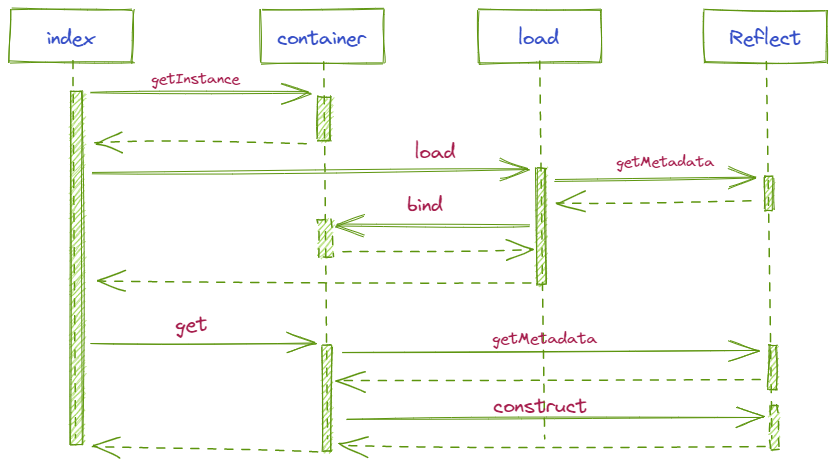

# Sequence diagram

# Overview
## My custom decorator
### provider
Provide the class with meta-information of binding id,clazz and parameter list.  
Use to register classes in the container. Just like @beans in Spring.
### inject
Provide the class with meta-information of the properties that are decorated.  
Use to register the dependencies of the class, handle class dependencies when getting a class from a container. Just like @Autowired in Spring.
## container
A global object that pre-registers the class definitions and initialization parameters of all the objects we need.You can register or get object in it.
## load
Scan the class information under a specific path, register them and handle dependencies in the container.

# Link
[如何基于 TypeScript 实现控制反转](https://juejin.cn/post/6898882861277904910)